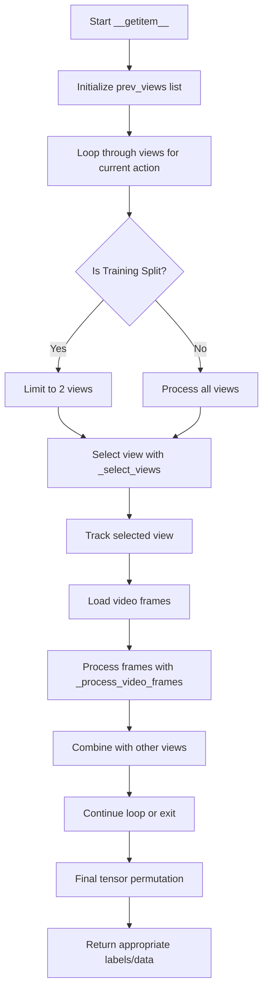

# MultiViewDataset.__getitem__ Method Explanation

The `__getitem__` method is a crucial component of the `MultiViewDataset` class that handles the loading and processing of multi-view video data for action recognition tasks. This method is called whenever we need to access a specific item from the dataset.

## Input
- `index`: Integer representing the index of the action sequence to retrieve

## Output
The method returns a tuple containing:
1. `labels_offence_severity`: A tensor of size 4 representing the offense severity classification
2. `labels_action`: A tensor of size 8 representing the action type classification
3. `videos`: A tensor of shape (V, C, N, H, W) where:
   - V = number of views
   - C = number of channels
   - N = number of frames
   - H = height
   - W = width
4. `number_of_actions`: The action ID or index string for challenge data

## Process Flow



## Key Components

### 1. View Selection with `_select_views` Method
```python
def _select_views(self, num_views: int, prev_views: List[int]) -> int:
    """Select view index based on split type."""
    if self.split == 'Train':
        while True:
            index = random.randint(0, num_views - 1)
            if index not in prev_views:
                return index
    return len(prev_views)
```

This helper method replaces the previous more complex inline code, making the view selection logic more readable and maintainable:
- For training: Randomly selects a view not previously selected
- For validation/testing: Returns sequential views

### 2. Video Processing with `_process_video_frames` Method
```python
def _process_video_frames(self, video: torch.Tensor) -> torch.Tensor:
    """Process video frames: extract, downsample, and transform."""
    # Extract frames between start and end
    frames = video[self.start:self.end, :, :, :]
    
    # Downsample frames
    final_frames = None
    for j in range(len(frames)):
        if j % self.factor < 1:
            frame = frames[j, :, :, :].unsqueeze(0)
            final_frames = frame if final_frames is None else torch.cat((final_frames, frame), 0)
    
    # Apply transformations
    final_frames = final_frames.permute(0, 3, 1, 2)
    if self.transform:
        final_frames = self.transform(final_frames)
    final_frames = self.transform_model(final_frames)
    
    return final_frames.permute(1, 0, 2, 3)
```

This method encapsulates the entire frame processing pipeline:
1. Extracts frames from the specified range
2. Downsamples frames according to the factor
3. Permutes dimensions for proper processing
4. Applies transformations
5. Returns the processed frames

### 3. Main `__getitem__` Method

The improved `__getitem__` method follows a clear step-by-step approach:

```python
def __getitem__(self, index: int) -> Tuple[torch.Tensor, torch.Tensor, torch.Tensor, Union[str, int]]:
    prev_views = []
    videos = None
    
    # Process each view
    for _ in range(len(self.clips[index])):
        if len(prev_views) == 2 and self.split == 'Train':
            break
            
        # Select view index
        index_view = self._select_views(len(self.clips[index]), prev_views)
        if self.split == 'Train':
            prev_views.append(index_view)
        
        # Load and process video
        video, _, _ = read_video(self.clips[index][index_view], 
                               output_format="THWC", 
                               pts_unit="sec")
        final_frames = self._process_video_frames(video)
        
        # Combine views
        if videos is None:
            videos = final_frames.unsqueeze(0)
        else:
            videos = torch.cat((videos, final_frames.unsqueeze(0)), 0)
    
    # Final tensor organization
    if self.num_views not in [1, 5]:
        videos = videos.squeeze()
    videos = videos.permute(0, 2, 1, 3, 4)
    
    # Return appropriate labels based on split
    if self.split != 'Chall':
        return (self.labels_offence_severity[index][0],
               self.labels_action[index][0],
               videos,
               self.number_of_actions[index])
    return -1, -1, videos, str(index)
```

## Key Improvements in the New Design

1. **Improved Modularity**
   - Separate helper methods for view selection and frame processing
   - Clear separation of responsibilities
   - Easier to maintain and test individual components

2. **Better Code Organization**
   - Logical grouping of related operations
   - Clear comments explaining each step
   - Consistent naming conventions

3. **Type Annotations**
   - Full type annotations for parameters and return values
   - Improved IDE support and code clarity
   - Better error checking during development

4. **More Readable Logic**
   - Simplified conditional statements
   - Explicit handling of training vs. evaluation modes
   - Clearer tracking of selected views 