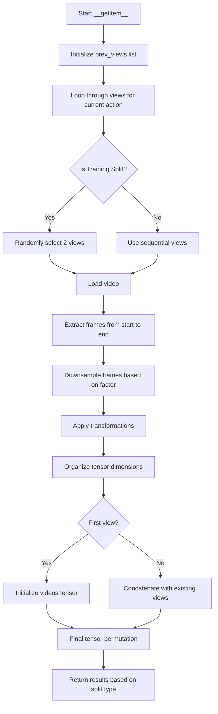

# MultiViewDataset.__getitem__ Method Explanation

The `__getitem__` method is a crucial component of the `MultiViewDataset` class that handles the loading and processing of multi-view video data for action recognition tasks. This method is called whenever we need to access a specific item from the dataset.

## Input
- `index`: Integer representing the index of the action sequence to retrieve

## Output
The method returns a tuple containing:
1. `labels_offence_severity`: A tensor of size 4 representing the offense severity classification
2. `labels_action`: A tensor of size 8 representing the action type classification
3. `videos`: A tensor of shape (V, C, N, H, W) where:
   - V = number of views
   - C = number of channels
   - N = number of frames
   - H = height
   - W = width
4. `number_of_actions`: The action ID or index string for challenge data

## Process Flow



## Detailed Steps

1. **View Selection**
   - For training (`split == 'Train'`):
     - Randomly selects 2 views even if more are available
     - Ensures no duplicate views are selected
   - For validation/testing:
     - Uses all available views (up to 4)

2. **Video Loading and Processing**
   ```python
   video, _, _ = read_video(self.clips[index][index_view], output_format="THWC")
   frames = video[self.start:self.end,:,:,:]
   ```
   - Loads video using torchvision's read_video
   - Extracts frames between specified start and end points

3. **Frame Downsampling**
   - Uses a factor to reduce the number of frames
   - Factor is calculated as: `(end - start) / (((end - start) / 25) * fps)`
   - Creates a consistent number of frames across videos

4. **Transformations**
   - Applies two types of transformations:
     1. General transformations (`self.transform`)
     2. Model-specific transformations (`self.transform_model`)
   - Handles tensor dimension reordering for proper processing

5. **Multi-view Assembly**
   - Combines multiple views into a single tensor
   - Handles different view configurations (1, 2, or more views)
   - Final shape: (V, C, N, H, W)

6. **Return Values**
   - For regular splits:
     ```python
     return self.labels_offence_severity[index][0], self.labels_action[index][0], videos, self.number_of_actions[index]
     ```
   - For challenge split:
     ```python
     return -1, -1, videos, str(index)
     ```

## Key Features

1. **Flexible View Handling**
   - Supports variable number of views (1 to 4)
   - Special handling for training vs. validation/testing

2. **Memory Efficient**
   - Downsamples frames to manage memory usage
   - Only loads required views

3. **Training Optimization**
   - Random view selection during training for better generalization
   - Consistent 2-view processing for batch training

4. **Challenge Mode Support**
   - Special handling for challenge data with placeholder labels 